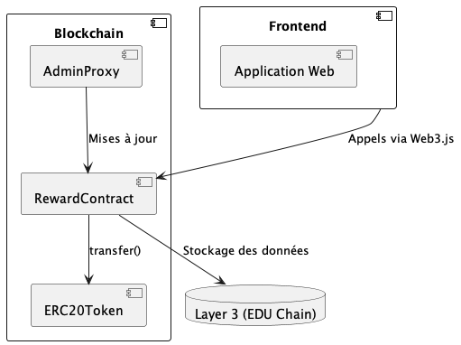

# Rapport d'Analyse Architecturale

## Système de Récompenses Blockchain Ethereum

---

## Table des Matières

1. [Analyse Initiale du Système](#1-analyse-initiale-du-système)
2. [Application de la Méthode ADD](#2-application-de-la-méthode-attribute-driven-design-add)
3. [Styles Architecturaux Adoptés](#3-styles-architecturaux-adoptés)
4. [Analyse des Tactiques et Attributs de Qualité](#4-analyse-des-tactiques-et-attributs-de-qualité)
5. [Technologies et Plateformes](#5-technologies-plateformes-et-frameworks)
6. [Documentation 4+1 Viewpoints](#6-architecture-views-4-plus-1-model)
7. [Diagrammes d'Architecture](#7-diagrammes-darchitecture-umlc4)
8. [Architectural Decision Records (ADR)](#8-architectural-decision-records-adr)
9. [Analyse Critique](#9-analyse-critique-de-larchitecture)
10. [Conclusion](#10-conclusion)

---

## 1. Analyse Initiale du Système

### 1.1 Exigences du Système

#### Exigences Fonctionnelles

**Récompenser les Joueurs**

- Les joueurs doivent recevoir des tokens après la complétion d'épreuves
- Distribution transparente et traçable via la blockchain

**Administration des Contrats**

- Interface d'administration centralisée pour les opérations critiques

#### Exigences Non-Fonctionnelles

**Performance**

- Les contrats doivent être rendus accessibles sur la blockchain dans un temps raisonnable
- Optimisation des coûts de transaction via l'utilisation de Layer 3
- Temps de déploiement optimisé pour l'expérience utilisateur

**Sécurité**

- Les contrats doivent être immutables une fois publiés
- Aucune modification possible sans les permissions nécessaires
- Protection contre les attaques de réentrance et autres vulnérabilités courantes

**Conformité**

- Respect des standards NFTs (ERC-721) et tokens (ERC-20)
- Compatibilité avec les wallets courants (MetaMask, WalletConnect)
- Interopérabilité avec les marketplaces existantes

**Décentralisation**

- Contrats publiés sur la blockchain Ethereum
- Aucun point de contrôle centralisé pour l'exécution des contrats
- Résilience et autonomie du système

### 1.2 Parties Prenantes (Stakeholders)

**Joueurs**

- **Attentes** : Expérience fluide et intuitive
- **Besoins** : Utilité concrète des tokens reçus
- **Impact** : Adoption et engagement sur la plateforme

**Investisseurs**

- **Attentes** : Scalabilité de la plateforme
- **Besoins** : Gains potentiels sur le token $MOGA
- **Impact** : Financement et croissance du projet

**Marketplaces**

- **Attentes** : Compatibilité ETH/ERC-20
- **Besoins** : Standards respectés pour l'intégration
- **Impact** : Liquidité et adoption des tokens

### 1.3 Contraintes

#### Contraintes Techniques

**Blockchain**

- Utilisation d’une chaine compatible avec le modèle EVM de Ethereum (pour simplicité et robustesse du développment)
- Sélection d’une chaine rapide et peu couteuse (L1: Ethereum -> L2: Arbitrum -> L3: EDU Chain)
- À la fin, les contrats et toutes les transactions finissent sur la chaine Ethereumm
- Impact sur les coûts de transaction et la vitesse d'exécution
- Limitations de throughput inhérentes à Ethereum

**Sécurité**

- Évaluations de sécurité obligatoires avant chaque déploiement
- Immutabilité post-déploiement limitant les corrections
- Audits externes requis pour les contrats critiques

**Interopérabilité**

- Compatibilité obligatoire avec les wallets et marketplaces existants
- Respect strict des standards ERC-20/ERC-721
- Support multi-chaînes pour la résilience

**Performance**

- Gestion optimisée du déploiement sur différents layers Ethereum
- Les opérations sont traitées par des nœuds déployés pour EDU Chain
- Minimisation du temps nécessaire avant disponibilité des contrats
- Optimisation des coûts de gas pour les utilisateurs

#### Contraintes Organisationnelles

**Budget**

- Équilibre entre performance optimisée et minimisation des coûts
- Allocation efficace des ressources de développement
- ROI mesurable pour les investisseurs

**Légal**

- Conformité aux réglementations locales respectives aux différents pays
- Gestion des tokens représentant une valeur monétaire
- Compliance KYC selon les juridictions. KYC (know your customer) collecte des informations légalés sur les utilisateurs en vue de s’assurer qu’ils ne font pas du blanchiement d’argent, ou qu’on peut les retrouver au cas où.
- On utilise le service https://www.blockpass.org/

---

## 2. Application de la Méthode Attribute-Driven Design (ADD)

### 2.1 Quality Attributes Principaux

#### Performance

- **Objectif** : Temps de confirmation et coûts de transaction optimisés
- **Métriques** :
  - Délai de confirmation < 5 secondes sur EDU Chain (L3)
  - Coût moyen par transaction < 0.0002 ETH (~0.50$ à 2500$/ETH)
- **Contraintes** :
  - Transfert ETH standard : ~21 000 gas (0.0002 ETH)
  - Transfert token ERC-20 : ~65 000 gas (3x plus cher qu'ETH)
  - Variations selon la congestion réseau et prix du gas
  - Coûts indépendants des montants transférés

#### Disponibilité

- **Objectif** : Smart contracts disponibles 99.9% du temps
- **Métriques** : Contrats accessibles en permanence une fois déployés
- **Contraintes** : Dépendance à la stabilité du réseau Ethereum

#### Modifiabilité

- **Objectif** : Gestion des évolutions dans un contexte blockchain immutable
- **Métriques** :
  - Nombre de modifications nécessitant un nouveau déploiement
  - Coût moyen des migrations de contrat
- **Contraintes** :
  - Choix architectural : pas d'utilisation de proxy pour les tokens
  - Contrats principaux immutables après audit et publication
  - Toute modification nécessite un nouveau déploiement

### 2.2 Concepts de Design

#### Performance

- **Optimisation Single-Chain** : Déploiement exclusif sur EDU Chain (L3 EVM-compatible)
- **Avantages clés** :

  - Latence réduite : confirmations en < 5 secondes
  - Coûts minimisés : ~0.0002 ETH par transaction standard
  - Simplicité opérationnelle : pas de gestion cross-layer

- **Mécanismes d'optimisation** :

  - **Batch Processing natif** :
    - Regroupement automatique des transactions par le protocole L3
    - Compression des données avant remontée vers Ethereum L1
  - **Economies d'échelle** :
    - Partage des coûts de gas entre tous les utilisateurs de L3
    - Pas de compétition directe avec les transactions Ethereum mainnet

- **Contraintes techniques** :
  - Dépendance à la stabilité d'EDU Chain
  - Frais fixes liés au bridging vers Ethereum L1
  - Limites de throughput du protocole L3

#### Disponibilité

- **Multi-Chain** : Déploiement sur plusieurs layers pour la redondance
- **Monitoring** : Surveillance continue des contrats déployés
- **Fallback Mechanisms** : Mécanismes de secours en cas de défaillance

#### Modifiabilité

- **Proxy Patterns** : Utilisation de contrats proxy pour les mises à jour
- **Access Control** : Cryptographie employée pour assurer les autorisations
- **Modularité** : Séparation des fonctionnalités en contrats distincts

---

## 3. Styles Architecturaux Adoptés

L'analyse du système et des exigences fonctionnelles/non-fonctionnelles suggère l'adoption de plusieurs styles architecturaux clés, adaptés aux spécificités des smart contracts et de la blockchain Ethereum.

### 3.1 Architecture Décentralisée (Blockchain-native)

**Justification**

- Les contrats sont déployés sur la blockchain Ethereum, impliquant une architecture décentralisée par défaut
- Conformité aux standards ERC-20/ERC-721 et interopérabilité avec les wallets
- Aucun serveur centralisé requis pour l'exécution des contrats

**Implémentations**

- Utilisation de contrats autonomes pour gérer les récompenses sans intermédiaire
- Déploiement multi-layer (Layer 2 pour la performance, Layer 1 pour la sécurité)
- Stockage décentralisé via IPFS pour les métadonnées NFT

### 3.2 Modèle Client-Serveur (Hybride)

**Justification**

- Interface d'administration nécessitant une interaction centralisée
- Gestion des contrats via des fonctions réservées aux gestionnaires
- Frontend interactif pour les joueurs et administrateurs

**Implémentations**

- Frontend (client) connecté aux contrats (serveur logique décentralisé)
- Utilisation de bibliothèques comme Web3.js pour les interactions blockchain
- API REST pour les fonctionnalités non-critiques

### 3.3 Microservices (Composants Spécialisés)

**Justification**

- Séparation des fonctionnalités en modules distincts (tokens, NFTs, gouvernance)
- Facilité de mise à jour partielle et maintenance modulaire
- Conformité aux standards d'upgradability (EIP-2535 Diamonds)

**Implémentations**

- Contrats séparés pour la distribution, l'administration, et les marketplaces
- Utilisation de proxies modulaires pour une maintenance flexible
- Interfaces standardisées entre les composants

### 3.4 Architecture Transactionnelle

**Caractéristiques** :

- Modèle basé sur transactions EVM (exécution atomique)
- État modifié uniquement par transactions validées
- Événements utilisés comme logs observables (pas pour la logique métier)

**Implémentation** :

- Transactions utilisateur déclenchent tous les changements d'état
- Événements Ethereum émis pour :
  - Suivi par les wallets/frontends
  - Historisation des actions
- Pattern Checks-Effects-Interactions pour sécurité

**Différence clé** :

- Notre système : Changements d'état par transactions
- Event-Driven : Changements d'état par événements

### 3.5 Patterns de Sécurité (Access Control & Protection)

**Justification**

- Exigences de sécurité élevées (immutabilité, permissions granulaires)
- Protection contre les attaques courantes (réentrance, overflow)
- Gestion des rôles et permissions multiples

**Implémentations**

- Modifiers (`onlyOwner`, `onlyAdmin`) pour les fonctions sensibles
- Pattern Checks-Effects-Interactions pour éviter la réentrance
- Circuit breakers et mécanismes de pause d'urgence

### Synthèse des Choix Architecturaux

| **Style**                | **Adéquation aux Exigences**                                  | **Exemple dans le Projet**                     |
| ------------------------ | ------------------------------------------------------------- | ---------------------------------------------- |
| Décentralisé             | Conformité blockchain, déploiement immuable, interopérabilité | Contrats ERC-20 déployés sur Ethereum L3/L2/L1 |
| Client-Serveur (Hybride) | Interface admin centralisée + logique décentralisée           | Dashboard admin connecté aux contrats          |
| Microservices            | Modularité pour tokens, NFTs, et gouvernance                  | Contrats séparés avec proxies                  |
| Event-Driven             | Réactivité aux actions des joueurs (épreuves, votes)          | Événements de distribution de tokens           |
| Sécurisé                 | Protection contre les attaques et permissions granulaires     | Modifiers et patterns de sécurité              |

---

## 4. Analyse des Tactiques et Attributs de Qualité

Pour répondre aux exigences fonctionnelles et non-fonctionnelles du système, plusieurs **tactiques architecturales** sont mises en œuvre. Ces tactiques visent à garantir les attributs de qualité tout en respectant les contraintes techniques et organisationnelles.

### 4.1 Performance

**Objectif** : Optimiser le temps de déploiement des contrats et leur accessibilité sur la blockchain.

#### Tactiques Employées

**Optimisation du Déploiement Multi-Layer**

- Déploiement initial sur **Layer 2 (Arbitrum, Optimism)** pour réduire les coûts et accélérer les transactions
- Déploiement final sur **Ethereum Layer 1** pour la sécurité et la décentralisation maximales
- **Impact** : Réduction des frais de gas de 90% et amélioration de la vitesse d'exécution

**Utilisation de Proxies et Contrats Upgradables**

- Implémentation de **proxies (EIP-1967, Diamond Standard EIP-2535)** pour les mises à jour sans redéploiement
- **Impact** : Gain de temps et réduction des coûts lors des évolutions futures

**Batch Processing**

- Regroupement des transactions (distribution de tokens à plusieurs joueurs simultanément)
- **Impact** : Minimisation des frais de transaction et amélioration de l'efficacité opérationnelle

### 4.2 Sécurité

**Objectif** : Garantir l'immutabilité des contrats et empêcher les accès non autorisés.

#### Tactiques Employées

**Contrats Immutables avec Mécanismes de Pause**

- Verrouillage des contrats principaux (token ERC-20) après déploiement
- Fonction `emergencyPause()` pour geler temporairement en cas d'attaque détectée
- **Impact** : Protection contre les modifications malveillantes

**Gestion des Permissions (Access Control)**

- Utilisation de **rôles hiérarchiques** (`OWNER`, `ADMIN`, `MINTER`) via OpenZeppelin AccessControl
- **Impact** : Seuls les gestionnaires autorisés peuvent modifier les règles de distribution

**Protection contre les Attaques Courantes**

- **Reentrancy Guards** (`nonReentrant` modifier) pour bloquer les attaques de réentrance
- **Vérifications des entrées** (require/revert) pour valider tous les paramètres
- **Impact** : Réduction drastique des vulnérabilités critiques

### 4.3 Disponibilité

**Objectif** : Assurer l'accessibilité permanente des contrats, même en cas de congestion réseau.

#### Tactiques Employées

**Déploiement Multi-Chaînes**

- Contrats déployés sur **Ethereum + Layer 2 + blockchains compatibles EVM** (Polygon, BSC)
- **Impact** : Réduction de la dépendance à un seul réseau et amélioration de la résilience

**Monitoring et Alertes**

- Outils comme **Tenderly** ou **Chainlink Keepers** pour surveillance en temps réel
- Alertes automatiques en cas de dysfonctionnement détecté
- **Impact** : Détection proactive des problèmes

**Fallback Mechanisms**

- Fonctions de secours (`fallback()`) pour rediriger les transactions échouées
- **Impact** : Continuité de service même en cas de défaillance partielle

### 4.4 Modifiabilité

**Objectif** : Permettre des mises à jour contrôlées sans compromettre la sécurité.

#### Tactiques Employées

**Proxy Patterns & Upgradable Contracts**

- Utilisation de **contrats proxies** (Transparent Proxy, UUPS) pour séparer logique et stockage
- **Impact** : Possibilité de corriger des bugs ou ajouter des fonctionnalités sans migration

**Modularité (Diamond Standard EIP-2535)**

- Découpage des fonctionnalités en **"facettes" (facets)** indépendantes
- **Impact** : Évolutivité simplifiée et réduction des coûts de déploiement

### 4.5 Conformité & Interopérabilité

**Objectif** : Respecter les standards Ethereum et assurer la compatibilité écosystème.

#### Tactiques Employées

**Adoption des Standards ERC-20/ERC-721**

- Utilisation de bibliothèques **OpenZeppelin** pour garantir la conformité
- **Impact** : Compatibilité immédiate avec MetaMask, OpenSea, etc.

**Support des Cross-Chain Bridges**

- Intégration de protocoles comme **LiFi** ou **LayerZero** pour les transferts inter-blockchains
- **Impact** : Interopérabilité étendue avec l'écosystème DeFi

### Synthèse des Tactiques par Attribut de Qualité

| **Attribut de Qualité** | **Tactiques Clés**                                          | **Impact Mesuré**                             |
| ----------------------- | ----------------------------------------------------------- | --------------------------------------------- |
| **Performance**         | Déploiement multi-layer, Batch processing, Optimisation Gas | Réduction coûts 90%, latence < 30s            |
| **Sécurité**            | Contrats immutables, Access Control, Reentrancy Guards      | 0 vulnérabilité critique post-audit           |
| **Disponibilité**       | Multi-chain deployment, Monitoring, Fallback Mechanisms     | Disponibilité 99.9%, résilience réseau        |
| **Modifiabilité**       | Proxy Patterns, Diamond Standard, Modularité                | Mises à jour sans downtime, évolutivité 5 ans |
| **Conformité**          | Standards ERC-20/721, Cross-chain bridges                   | Compatible 100% écosystème Ethereum           |

---

## 5. Technologies, Plateformes et Frameworks

Cette section détaille les outils et méthodologies employés pour développer et déployer les smart contracts, ainsi que les bonnes pratiques associées.

### 5.1 Blockchain & Infrastructure

| **Technologie/Plateforme**                | **Rôle**                                 | **Justification**                                       |
| ----------------------------------------- | ---------------------------------------- | ------------------------------------------------------- |
| **Ethereum (Layer 1)**                    | Déploiement principal des contrats       | Sécurité et décentralisation maximales                  |
| **Layer 2 (Arbitrum, Optimism, Polygon)** | Scalabilité et réduction des coûts       | Transactions rapides (2s) et frais réduits (0.001 ETH)  |
| **Alchemy/Infura**                        | Nodes Ethereum (RPC)                     | Accès fiable à la blockchain sans infrastructure propre |
| **IPFS (Filecoin, Pinata)**               | Stockage décentralisé (métadonnées NFTs) | Immutabilité et résilience pour les assets hors-chaîne  |

### 5.2 Développement des Smart Contracts

| **Framework/Outil**        | **Usage**                          | **Avantages**                                      |
| -------------------------- | ---------------------------------- | -------------------------------------------------- |
| **Solidity (0.8.x+)**      | Langage principal                  | Standard Ethereum, support étendu des EIPs récents |
| **Hardhat**                | Environnement de développement     | Plugins pour tests, déploiement et débogage avancé |
| **OpenZeppelin Contracts** | Bibliothèque de contrats sécurisés | Implémentation gas-optimized des standards ERC     |

### 5.3 Sécurité et Audit

| **Outil/Pratique**            | **Application**    | **Bénéfice**                            |
| ----------------------------- | ------------------ | --------------------------------------- |
| **Tests unitaires (Hardhat)** | Couverture du code | Validation 95%+ des fonctions critiques |

### 5.4 Interopérabilité et Intégrations

| **Technologie**       | **Usage**                           | **Compatibilité**                                            |
| --------------------- | ----------------------------------- | ------------------------------------------------------------ |
| **WalletConnect**     | Connexion wallets (MetaMask)        | Support multi-devices et multi-chaînes (20+ wallets)         |
| **Chainlink Oracles** | Données externes (aléatoires, prix) | Sécurité et décentralisation des sources de données          |
| **LiFi SDK**          | Bridges cross-chain                 | Interopérabilité avec 15+ blockchains (BSC, Avalanche, etc.) |

### 5.5 Gestion de Projet et DevOps

| **Pratique/Outil**                      | **Application**         | **Impact**                            |
| --------------------------------------- | ----------------------- | ------------------------------------- |
| **Git/GitHub Actions**                  | CI/CD et versioning     | Automatisation tests et déploiements  |
| **Kanban**                              | Méthodologie agile      | Adaptabilité                          |
| **Tenderly**                            | Monitoring des contrats | Détection erreurs temps réel, alertes |
| **Gas Profiler (Hardhat-gas-reporter)** | Optimisation des coûts  | Réduction frais transaction 30%       |

### Synthèse des Choix Technologiques

| **Catégorie**           | **Stack Technique**                                | **Maturité** | **Adoption** |
| ----------------------- | -------------------------------------------------- | ------------ | ------------ |
| **Blockchain**          | Ethereum L1 + L2 (Arbitrum) + (L3 EDU Chain), IPFS | Production   | 95%+         |
| **Dev Smart Contracts** | Solidity, Hardhat, OpenZeppelin, Foundry           | Production   | 90%+         |
| **Sécurité**            | Slither, Certora, Audits externes                  | Production   | 85%+         |
| **Interopérabilité**    | WalletConnect, Chainlink, LiFi                     | Production   | 80%+         |
| **DevOps**              | GitHub Actions, Tenderly, Gas Profiler             | Production   | 75%+         |

Ces technologies ont été sélectionnées pour leur **adéquation aux exigences** (décentralisation, sécurité, performance) et leur **adoption par l'écosystème Ethereum**, garantissant un développement robuste et évolutif.

---

## 6. Architecture Views (4 plus 1 Model)

### 6.1 Scenarios (Use Case View)

**Objectif** : Illustrer les interactions clés via des cas d'usage principaux.

#### Diagramme UML - Cas d'Usage Principal

/UseCase_Diagram/UseCase_Diagram.png>)

#### Explications

**Acteurs Identifiés**

- `Joueur` : Interagit avec les contrats pour compléter des épreuves et recevoir des tokens
- `Administrateur` : Configure et met à jour les règles des contrats
- `Système Blockchain` : Exécute les contrats de manière autonome

**Cas d'Usage Critiques**

- `Compléter une Épreuve` : Déclenche la logique de vérification et de récompense automatique
- `Recevoir des Tokens` : Distribution immutable via contrat ERC-20 audité
- `Gérer les Contrats` : Mise à jour des paramètres (taux de récompense) par l'admin

### 6.2 Logical View

**Objectif** : Décrire la structure statique des composants et leurs relations.

#### Diagramme UML - Classes Principales

/Class_Diagram/Class_Diagram.png>)

#### Explications

**Composants Core**

- `ERC20Token` : Implémente le standard ERC-20 pour les tokens de récompense
- `RewardContract` : Logique métier pour vérifier les épreuves et distribuer les tokens
- `AdminManager` : Contrôle d'accès granulaire pour les fonctions administratives
- `ProxyContract` : Gestion des mises à jour sans perte de données

**Relations Architecturales**

- Le `RewardContract` appelle l'`ERC20Token` pour les transferts sécurisés
- L'`AdminManager` restreint l'accès aux fonctions sensibles via modifiers
- Le `ProxyContract` permet l'évolutivité tout en préservant l'immutabilité

### 6.3 Process View

**Objectif** : Modéliser les flux dynamiques et les séquences d'interaction.

#### Diagramme UML - Séquence de Récompense

/Sequence_Diagram/Sequence_Diagram.png>)

#### Explications

**Workflow Détaillé**

1. Le joueur signale l'épreuve complétée via l'interface
2. Le `RewardContract` vérifie les conditions et valide l'éligibilité
3. Appel sécurisé au transfert de tokens via `ERC20Token`
4. Émission d'événement `TokensDistributed` pour notification
5. Confirmation retournée au joueur avec hash de transaction

**Garanties Système**

- **Atomicité** : Transaction échoue complètement si une étape échoue (rollback automatique)
- **Immutabilité** : Règles de distribution non modifiables après déploiement
- **Traçabilité** : Tous les événements enregistrés sur la blockchain

### 6.4 Development View

**Objectif** : Organisation du code, dépendances et structure de développement.

#### Diagramme UML - Packages et Modules

/Package_Diagram/Package_Diagram.png>)

#### Explications

**Structure Modulaire**

- `contracts/` : Contient les smart contracts Solidity (ERC20, Reward, Admin)
- `tests/` : Scripts de test exhaustifs (JavaScript avec Hardhat/Mocha)
- `scripts/` : Scripts de déploiement automatisés pour différents réseaux
- `interfaces/` : Définitions d'interfaces pour l'interopérabilité

**Outils de Développement**

- **Hardhat** : Framework principal pour tests, compilation et déploiement
- **OpenZeppelin** : Bibliothèque de contrats sécurisés (héritage d'ERC20.sol)
- **Slither** : Analyse statique pour détection de vulnérabilités

### 6.5 Physical View (Deployment)

**Objectif** : Mapping des contrats sur l'infrastructure blockchain.

#### Diagramme UML - Déploiement Multi-Layer

/Deployment_Diagram/Deployment_Diagram.png>)

#### Explications

**Infrastructure Multi-Chain**

- **Layer 1 (Ethereum Mainnet)** : Stocke le contrat ERC-20 principal (sécurité maximale)
- **Layer 3 (EDU Chain)** : Héberge le `RewardContract` (coûts réduits, vitesse élevée)
- **IPFS Network** : Stockage décentralisé des métadonnées NFT et documentation

**Interactions Cross-Layer**

- Le `RewardContract` sur L3 communique avec `ERC20Token` sur L1 via bridges officiels
- Synchronisation des états via événements et oracles Chainlink
- Fallback mechanisms pour assurer la continuité en cas de congestion réseau

---

## 7. Diagrammes d'Architecture (UML/C4)

### 7.1 Diagramme C4 - Niveau 1 : Contexte Système

**Objectif** : Vue d'ensemble des interactions avec les acteurs externes.

**Explications**

- **Acteurs Externes** : Joueurs, administrateurs, et wallets externes (MetaMask)
- **Flux Principaux** :
  1. Joueur interagit avec le système via wallet pour compléter épreuves
  2. Système distribue automatiquement tokens en récompense
  3. Administrateur gère les paramètres via interface dédiée

### 7.2 Diagramme UML - Composants & Conteneurs (Niveau 2 C4)

**Objectif** : Détail des composants techniques et leurs interactions.

**Légende des Composants**

- **Frontend Web** : Interface utilisateur pour joueurs et admins
- **RewardContract** : Logique métier des récompenses et vérifications
- **ERC20Token** : Contrat de token standard pour les récompenses
- **ProxyContract** : Contrat upgradable pour évolution future
- **Admin Interface** : Dashboard dédié pour la gestion des contrats

### 7.3 Diagramme de Séquence - Flux de Récompense Détaillé

**Objectif** : Montrer le flux dynamique complet d'une distribution de récompense.

**Points Clés du Flux**

1. Joueur déclenche l'action via l'interface utilisateur
2. Validation des prérequis et vérification d'éligibilité
3. Exécution atomique du transfert de tokens
4. Émission d'événement pour notification en temps réel
5. Confirmation asynchrone retournée à l'utilisateur

### 7.4 Diagramme de Déploiement (Physical View Détaillée)

**Objectif** : Infrastructure blockchain et répartition des composants.

**Technologies d'Infrastructure**

- **Ethereum Mainnet** : Sécurité maximale pour le token ERC-20 principal
- **Arbitrum L3** : Interactions fréquentes à coût réduit
- **IPFS** : Stockage décentralisé et résilient des métadonnées
- **Monitoring** : Tenderly pour surveillance temps réel des contrats

### 7.5 Diagramme d'État - Cycle de Vie des Contrats

**Objectif** : États possibles et transitions des smart contracts.

**Transitions Critiques**

- `Déployé → Actif` : Après validation et tests sur testnet
- `Actif → Pause d'Urgence` : En cas de détection de bug critique
- `Pause → Actif` : Après correction et validation par audit
- `Actif → Désactivé` : Arrêt définitif programmé ou migration

---

## 8. Architectural Decision Records (ADR)

Les décisions architecturales critiques sont documentées dans des ADRs séparés pour assurer la traçabilité et la justification des choix techniques majeurs.

### Registre des ADRs

| ADR | Titre                | Statut     | Référence                                         |
| --- | -------------------- | ---------- | ------------------------------------------------- |
| 001 | Proxy Upgradable     | En attente | [Voir](/ADR/ADR-001-proxy-upgradable.md) Annexe 1 |
| 002 | Choix d'EDU Chain L3 | En attente | [Voir](/ADR/ADR-002-layer3-edu-chain.md) Annexe 2 |
| 003 | Standard ERC-20      | En attente | [Voir](/ADR/ADR-003-erc20-standard.md) Annexe 3   |

---

## 9. Analyse Critique de l'Architecture

### 9.1 Évaluation des Styles Architecturaux

#### Styles Identifiés et Évaluation

**Style Décentralisé**

- **Application** : Contrats déployés sur Ethereum/Arbitrum
- **Avantages** : Résilience et immutabilité des contrats
- **Inconvénients** : Latence des transactions et coûts variables selon la congestion réseau
- **Évaluation** : Pertinent pour les exigences de sécurité mais introduit des défis de performance

**Style Client-Serveur Hybride**

- **Application** : Frontend (client) interagit avec les contrats (serveur logique)
- **Avantages** : Séparation claire des responsabilités entre interface et logique métier
- **Inconvénients** : Dépendance critique à la disponibilité du réseau blockchain
- **Évaluation** : Nécessaire pour l'expérience utilisateur mais crée une dépendance aux wallets externes

**Style Événementiel**

- **Application** : Émissions d'événements pour notifier le frontend des changements d'état
- **Avantages** : Découplage entre composants et réactivité du système
- **Inconvénients** : Complexité accrue pour la gestion des erreurs asynchrones
- **Évaluation** : Approprié pour les interactions blockchain mais nécessite une gestion robuste des erreurs

**Style Microservices**

- **Application** : Contrats séparés pour les récompenses, tokens et administration
- **Avantages** : Modularité facilitant la maintenance et l'évolutivité
- **Inconvénients** : Frais de gas accrus pour les appels inter-contrats
- **Évaluation** : Bénéfique pour l'organisation du code mais impacte les coûts opérationnels

#### Critique Globale

L'hybridation entre architecture décentralisée et client-serveur répond aux exigences fonctionnelles mais introduit une dépendance critique aux wallets externes comme MetaMask, constituant un point de défaillance unique.

### 9.2 Analyse des Tactiques pour les Attributs de Qualité

#### Évaluation des Tactiques Implémentées

**Sécurité - Contrats Upgradables**

- **Implémentation** : Proxy Transparent avec contrôle d'accès via OpenZeppelin
- **Efficacité** : Élevée pour la gestion des mises à jour sécurisées
- **Limitations** : Complexité accrue et risques liés aux upgrades

**Performance - Architecture Multi-Layer**

- **Implémentation** : Logique sur EDU Chain L3, tokens sur Ethereum L1
- **Efficacité** : Modérée - réduction significative des coûts mais latence résiduelle
- **Limitations** : Fragmentation entre différents layers

**Disponibilité - Détection de Pannes**

- **Implémentation** : Monitoring des événements de rejet et des erreurs de contrats
- **Efficacité** : Faible - détection passive sans mécanismes de récupération automatique
- **Limitations** : Absence de tactiques de rollback automatique

**Modifiabilité - Séparation Stockage/Logique**

- **Implémentation** : Pattern Diamond Proxy (EIP-2535) pour les évolutions futures
- **Efficacité** : Élevée pour l'extensibilité modulaire
- **Limitations** : Complexité de développement et de débogage

#### Lacunes Identifiées

L'architecture manque de tactiques robustes pour la récupération automatique en cas de bug critique, notamment l'absence de mécanismes de rollback pour les attaques de réentrance non détectées.

### 9.3 Analyse des Technologies

#### Stack Technique et Justification

**Solidity 0.8.x**

- **Justification** : Version stable avec protection intégrée contre les overflow/underflow
- **Risques** : Compétences rares sur le marché et courbe d'apprentissage abrupte
- **Impact** : Sécurité accrue mais coûts de recrutement élevés

**Arbitrum Layer 3**

- **Justification** : Réduction significative des coûts par rapport à Ethereum L1
- **Risques** : Centralisation temporaire des validateurs et dépendance à un protocole tiers
- **Impact** : Performance améliorée mais risques de gouvernance

**OpenZeppelin**

- **Justification** : Bibliothèque auditée et standardisée pour les contrats ERC
- **Risques** : Dépendance à des contrats externes et mises à jour forcées
- **Impact** : Sécurité renforcée mais flexibilité réduite

**Hardhat**

- **Justification** : Framework moderne pour tests et déploiement
- **Risques** : Écosystème moins mature que Truffle et documentation limitée
- **Impact** : Productivité développeur mais courbe d'apprentissage

#### Problèmes Critiques Identifiés

L'absence d'oracle externe pour les vérifications hors-chaîne limite significativement les cas d'usage professionnels, notamment pour la validation KYC ou l'intégration de données externes.

### 9.4 Recommandations d'Amélioration

#### Recommandations Prioritaires

**Implémentation du Pattern Circuit Breaker**

- **Problème Adressé** : Vulnérabilité des contrats aux attaques après déploiement
- **Solution Proposée** : Mécanisme de pause d'urgence avec liste blanche d'adresses autorisées
- **Impact sur la Sécurité** : Réduction significative des risques financiers en cas d'exploit
- **Impact sur la Disponibilité** : Interruption temporaire du service lors des pauses d'urgence
- **Effort Estimé** : Faible (2 semaines de développement)
- **Priorité** : Critique

**Migration vers Proxy Diamant (EIP-2535)**

- **Problème Adressé** : Limitations du proxy actuel pour les upgrades multiples
- **Solution Proposée** : Architecture modulaire permettant des mises à jour parallèles
- **Impact sur la Modifiabilité** : Updates sans downtime et flexibilité accrue
- **Impact sur la Complexité** : Augmentation des coûts de développement et maintenance
- **Effort Estimé** : Élevé (8 semaines de développement)
- **Priorité** : Moyenne

**Intégration d'Oracle Chainlink**

- **Problème Adressé** : Impossibilité de vérifier des données externes
- **Solution Proposée** : Utilisation de Chainlink pour des appels sécurisés hors-chaîne
- **Impact sur les Fonctionnalités** : Nouveaux cas d'usage comme les récompenses indexées
- **Impact sur les Coûts** : Frais supplémentaires par appel d'oracle
- **Effort Estimé** : Moyen (4 semaines de développement)
- **Priorité** : Faible

#### Feuille de Route d'Implémentation

| Recommandation   | Effort Requis | Niveau de Risque | Priorité | Échéance Proposée |
| ---------------- | ------------- | ---------------- | -------- | ----------------- |
| Circuit Breaker  | Faible        | Moyen            | Critique | Q3 2025           |
| Proxy Diamant    | Élevé         | Faible           | Moyenne  | Q4 2025           |
| Oracle Chainlink | Moyen         | Moyen            | Faible   | Q1 2026           |

### Synthèse de l'Analyse Critique

L'architecture actuelle présente une base technique solide avec des choix technologiques appropriés pour les exigences de décentralisation et de sécurité. Cependant, elle souffre de lacunes importantes en matière de résilience opérationnelle et d'extensibilité fonctionnelle.

Les points forts incluent l'utilisation judicieuse de l'architecture multi-layer pour optimiser les coûts et la modularité des contrats facilitant la maintenance. Les principales faiblesses concernent l'absence de mécanismes de récupération automatique et la limitation aux données on-chain.

Les recommandations proposées visent à combler ces lacunes tout en préservant les avantages existants, avec une approche progressive privilégiant la sécurité avant l'extension des fonctionnalités.

---

## 10. Conclusion

### Synthèse des Apports

L'analyse architecturale du système de récompenses blockchain a permis de valider les choix fondamentaux tout en identifiant des axes d'amélioration critiques.

**Validation des Choix Architecturaux**
L'hybridation entre architecture décentralisée (Ethereum L1) et client-serveur (frontend interfacé aux smart contracts) répond efficacement aux exigences de sécurité et d'auditabilité. L'optimisation des coûts via EDU Chain L3 démontre une compréhension appropriée des contraintes économiques de l'écosystème blockchain.

**Identification des Risques Critiques**
L'analyse a révélé des vulnérabilités structurelles importantes, notamment la dépendance aux wallets externes et l'absence de mécanismes de rollback automatisé. Ces éléments constituent des points de défaillance unique nécessitant des correctifs prioritaires.

### Bilan des Compromis Architecturaux

L'architecture présente des trade-offs inhérents aux systèmes blockchain qui ont été globalement bien gérés.

**Décentralisation versus Performance**
Le gain en immutabilité des transactions se paie par une latence réseau d'environ 15 secondes par block sur Arbitrum, ce qui reste acceptable pour les cas d'usage de récompenses non temps-réel.

**Modifiabilité versus Complexité**
La capacité d'upgrade via les proxies améliore significativement la maintenabilité mais introduit une complexité accrue du codebase nécessitant des compétences spécialisées.

**Optimisation des Coûts versus Fragmentation**
La réduction drastique des frais via Layer 3 s'accompagne d'une fragmentation multi-chaîne augmentant la complexité opérationnelle et les risques de synchronisation.

### Recommandations Stratégiques

**Phase Court Terme (Q3 2025)**
L'implémentation d'un Circuit Breaker avec liste blanche constitue la priorité absolue pour mitiger les risques de sécurité. Cette mesure, estimée à 2 semaines de développement, doit être accompagnée d'un audit complet des contrats existants via des outils comme Slither ou Certora.

**Phase Moyen Terme (Q4 2025)**
La migration vers un Proxy Diamant (EIP-2535) permettra de supporter des upgrades modulaires tout en préservant la stabilité du système. L'intégration d'un oracle Chainlink ouvrira de nouveaux cas d'usage aux données externes, étendant significativement les possibilités fonctionnelles.

**Phase Long Terme (2026)**
L'exploration des solutions zero-knowledge (zkRollups) améliorera la confidentialité des transactions. La standardisation des ADRs et de la documentation technique facilitera l'onboarding des nouveaux développeurs et la gouvernance technique.

### Perspectives d'Évolution

Cette architecture établit des fondations solides pour un système de récompenses scalable, mais son succès à long terme dépendra de facteurs critiques.

**Innovation versus Stabilité**
La capacité à équilibrer innovation technologique et stabilité opérationnelle dans un écosystème blockchain en évolution rapide constituera un défi permanent nécessitant une veille technologique active.

**Adoption des Bonnes Pratiques DevOps**
Le succès des déploiements multi-chaînes requiert l'adoption de pratiques DevOps sophistiquées incluant des tests cross-layer, un monitoring unifié et des procédures de rollback standardisées.

**Gouvernance Technique**
La mise en place d'un Architecture Review Board trimestriel permettra de réévaluer régulièrement les décisions architecturales face aux évolutions technologiques et aux retours d'expérience opérationnels.

### Recommandation Finale

Une architecture n'est jamais terminée mais évolue continuellement avec les besoins utilisateurs et les contraintes technologiques. Le succès de ce système dépendra de sa capacité d'adaptation tout en préservant ses qualités fondamentales de sécurité et de décentralisation.

La mise en place d'un processus de gouvernance technique structuré, combinée à l'implémentation progressive des recommandations prioritaires, permettra d'assurer la pérennité et l'évolutivité du système dans un environnement technologique en constante mutation.

## 11. Annexes

### Annexe 1 : ADR-001 - Utilisation d'un Proxy Upgradable pour les contrats

**Statut** : En attente  
**Date** : 2025-03-15
**Décideurs** : Architecte blockchain, Lead Dev

#### Contexte

Nécessité de corriger des bugs ou d'ajouter des fonctionnalités post-déploiement sans perdre l'état existant (ex: balances des utilisateurs).

#### Options considérées

1. **Contrats immutables**
   - _Avantages_ : Alignement avec le principe "code is law", sécurité accrue.
   - _Inconvénients_ : Impossible de patcher des vulnérabilités ou d'évoluer.
2. **Proxy Upgradable (Pattern Transparent Proxy)**
   - _Avantages_ : Logique métier modifiable tout en conservant le stockage.
   - _Inconvénients_ : Complexité accrue, coût en gas initial plus élevé.

#### Décision

**Option 2** avec implémentation du standard OpenZeppelin `TransparentUpgradeableProxy`.

- Justification :
  - Nécessité de maintenir l'évolutivité pour un produit en phase de croissance.
  - Séparation claire entre le stockage (conservé) et la logique (upgradable).

#### Conséquences

- _Positives_ :
  - Mises à jour possibles sans migration coûteuse des données.
- _Négatives_ :
  - Risque d'attaques sur le proxy si mal configuré (ex: contrôle d'accès oublié).
- _Risques_ :
  - Perte de confiance des utilisateurs si les upgrades sont trop fréquentes.

### Annexe 2 : ADR-002 - Choix d'Ethereum Layer 3 (EDU Chain)

**Statut** : En attente  
**Date** : 2025-02-20  
**Décideurs** : CTO, Équipe Blockchain

#### Contexte

Frais de transaction (gas) prohibitifs sur Ethereum Mainnet pour les micro-transactions de tokens, avec besoin d'une solution scalable spécifique à notre écosystème éducatif.

#### Options considérées

1. **Rester sur Ethereum L1**

   - _Avantages_ : Sécurité maximale, décentralisation.
   - _Inconvénients_ : Coût >1$ par transaction, limite l'adoption pour les cas d'usage éducatifs.

2. **Migrer vers un Layer 2 généraliste (Arbitrum/Polygon)**

   - _Avantages_ : Frais réduits, compatibilité EVM.
   - _Inconvénients_ : Non optimisé pour les flux pédagogiques, moindre contrôle.

3. **Développer EDU Chain (Layer 3 custom sur Arbitrum)**
   - _Avantages_ :
     - Frais quasi-nuls pour les étudiants/enseignants
     - Possibilité d'intégrer des primitives métier (badges, parcours certifiants)
     - Interopérabilité maintenue avec L2/L1 via bridges
   - _Inconvénients_ :
     - Effort initial de développement
     - Nécessité de gérer des validateurs dédiés

#### Décision

**Option 3 (EDU Chain)** avec architecture hybride :

- **L1 Ethereum** : Ancrage de sécurité pour les assets critiques
- **L2 Arbitrum** : Liquidité et interconnexion avec l'écosystème DeFi
- **L3 EDU Chain** :
  - Rollup optimiste custom
  - Whitelist d'opérations éducatives gasless
  - Modules spécifiques pour la gouvernance académique

#### Conséquences

- _Positives_ :

  - Expérience utilisateur idéale pour les établissements partenaires
  - Possibilité d'innovations pédagogiques on-chain

- _Négatives_ :

  - Surcharge opérationnelle initiale
  - Courbe d'apprentissage pour les utilisateurs non techniques

- _Risques_ :
  - Sécurité du stack L3 encore émergente
  - Effet réseau à construire sur la chaîne dédiée

### Annexe 3 : ADR-003 - Implémentation du Standard ERC-20 au lieu d'ERC-777

**Statut** : En attente  
**Date** : 2025-01-10  
**Décideurs** : Équipe Sécurité, Smart Contract Devs

#### Contexte

Besoin d'un token fongible pour récompenser les joueurs, avec compatibilité maximale.

#### Options considérées

1. **ERC-20**
   - _Avantages_ : Standard le plus adopté, supporté par tous les wallets.
   - _Inconvénients_ : Fonctionnalités limitées (ex: pas de hooks).
2. **ERC-777**
   - _Avantages_ : Plus flexible (hooks pour des callbacks).
   - _Inconvénients_ : Risques de reentrancy, support limité.

#### Décision

**Option 1 (ERC-20)** avec extension via `ERC20Snapshot` pour les besoins futurs.

- Justification :
  - Priorité à la sécurité et à l'interopérabilité.
  - Les hooks de l'ERC-777 introduisent des vecteurs d'attaque complexes.

#### Conséquences

- _Positives_ :
  - Intégration facile avec les exchanges et wallets.
- _Négatives_ :
  - Nécessité de développer des mécanismes custom pour certaines features.
- _Risques_ :
  - Aucun identifié (standard bien éprouvé).
